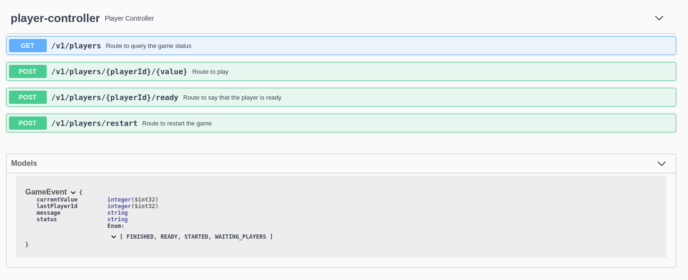

# Game of Movement

This project is a Game of Three implementation. It does not provide a web interface. Thus, the player must use an HTTP API client, like Postman, curl, or the Swagger UI, available at the URL <http://localhost:8080/swagger-ui/>, if you are using de default configuration. The solution tries to be as simple as possible, what brings on a few problems, described in section *Known issues*.

The main technologies used in this game are:

* Java 11;
* Spring Boot;
* Spring for Apache Kafka;
* Apache Kafka;

## API documentation

The game is composed by the following endpoints. In the next section, we can see a complete example of how to play a game.

* `POST /v1/players/{playerId}/ready`: say that the player is ready;
* `POST /v1/players/{playerId}/{value}`: send a new value;
* `GET /v1/players`: query the game state;
* `POST /v1/players/restart`: restart the game.

The image below shows the Swagger UI of the application, available at <http://localhost:8080/swagger-ui/>.



## How to play

Before playing, both players (1 and 2) must be ready, achieved by using the endpoint `POST /v1/players/{playerId}/ready`. After that, each player can send a value, which is validated by the application. If the sent value is invalid, the player must choose a different number.

To check the current status you can use `GET http://localhost:8080/v1/players`.

Let's see an example:

1. `GET http://localhost:8080/v1/players`
2. `POST http://localhost:8080/v1/players/1/ready`
3. `POST http://localhost:8080/v1/players/2/ready`
4. `POST http://localhost:8080/v1/players/1/56`
5. `GET http://localhost:8080/v1/players`
6. `POST http://localhost:8080/v1/players/2/1`
7. `POST http://localhost:8080/v1/players/1/-1`
8. `POST http://localhost:8080/v1/players/2/0`
9. `POST http://localhost:8080/v1/players/1/1`
10. `GET http://localhost:8080/v1/players`

The status of movement #1 is `WAITING_PLAYERS` until both players are ready.

```json
{
    "lastPlayerId": null,
    "currentValue": null,
    "message": null,
    "status": "WAITING_PLAYERS"
}
```

The resulting body of movement #4 is the following:

```json
{
    "lastPlayerId": 1,
    "currentValue": 56,
    "message": "First play with value [56].",
    "status": "STARTED"
}
```


```json
{
    "lastPlayerId": 1,
    "currentValue": 1,
    "message": "Player 1 is the winner.",
    "status": "FINISHED"
}
```

## Error messages

For each rule, the application has an expected error messages:

* Invalid player (#x). It is the other's player turn.
* Invalid input. Valid values are -1, 0, 1.
* The value [x] is invalid. The resulting operation is not divisible by 3. Try another value.
* The game does not have a winner.
* We are waiting for the players to join the game.

## Configurations

The main application properties can be configured externally, for example, in the `application.properties` file we can see these properties:

* `server.port=${port:8080}`;
* `spring.kafka.bootstrap-servers=${bootstrap-servers:localhost:9092}`;
* `spring.kafka.consumer.group-id=${group-id:game-player-group}`;
* `spring.kafka.consumer.client-id=${client-id:game-client}`;
* `game.topic=${game-topic:game-topic}`
* `ready.topic=${ready-topic:ready-topic}`

If you want the customize one of them just pass the correct parameter name. For example `-Dport=8080`.

## Known issues

The application uses Apache Kafka as a message consumer, thus, there are synchronization issues. Unfortunately, it was not possible to fix them yet. Maybe we need a more complex solution with different topics and concurrency control. Other improvements could be using design patterns to implement the rules, like Decorator.

## Running the app

The application uses Apache Kafka and provides a `docker-compose.yml` to run it. This image is provided by Bitnami. The Kafka cluster must be running before the application.

To run the Kafka image use the command:

```bash
docker-compose up
```

The application can use Docker to run. To build the app use the commands:

```bash
mvn package -DskipTests
docker build -t game/game-of-movement .
docker run --name game-of-movement --network host --rm game/game-of-movement
```

## Author

Marco Reis

Software Engineer

e-mail: ma@marcoreis.net
